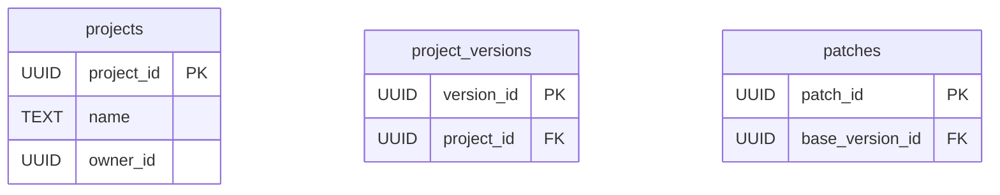

```mermaid
erDiagram
    projects {
      UUID project_id PK
      TEXT name
      UUID owner_id
    }
    project_versions {
      UUID version_id PK
      UUID project_id FK
    }
    patches {
      UUID patch_id PK
      UUID base_version_id FK
    }
```
